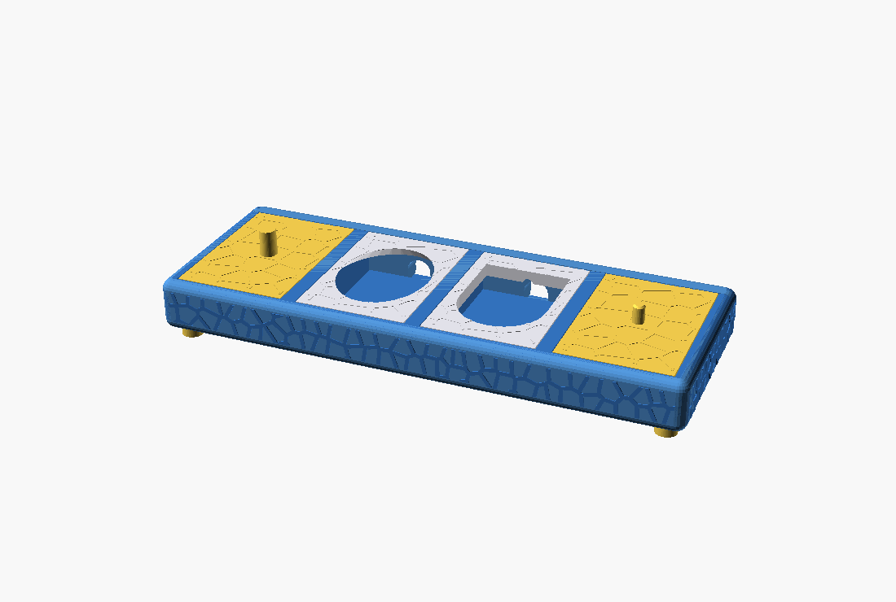
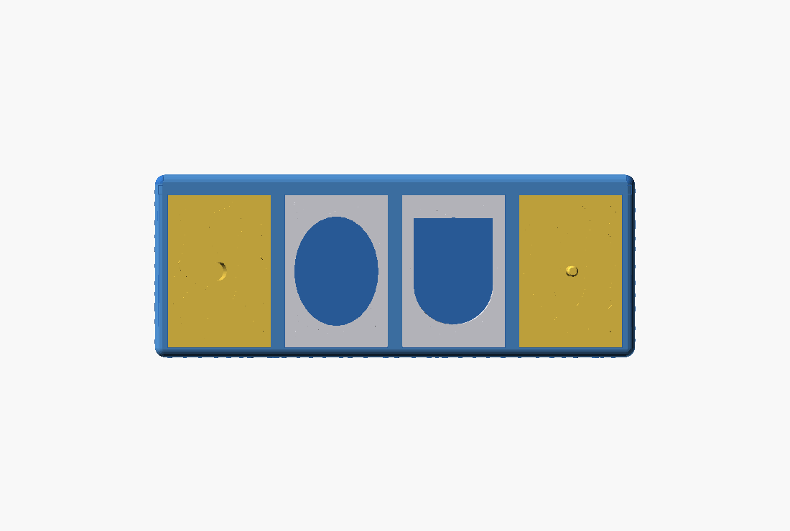
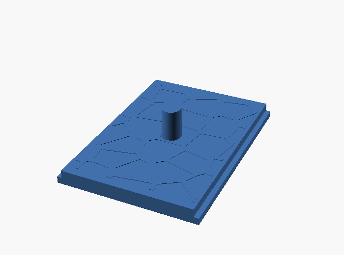

# Elektrischer Zahnbürstenhalter – frei konfigurierbar (Oral-B + Sonicare)

**Eigenentwicklung**: ein parametrischer Halter mit **1–4 frei konfigurierbaren
Fächern** (je Oral-B/Sonicare × Ständer/Laden), **Voronoi-Relief** außen und
**austauschbaren Voronoi-Einsteckgittern**.
Die gesamte Geometrie ist eigenständig in OpenSCAD (parametrisch) + Python
(Voronoi-Erzeugung, 3MF-Packen) konstruiert. Übernommen wurden **keine fremden
Modelle** – lediglich die *funktionalen Schnittstellenmaße* (Ladeöffnungen,
Zapfen, Ladehöhen) wurden an Referenzteilen vermessen, damit die Ladestationen
und Bürsten von Oral-B und Sonicare passen.

<p align="center">
  <br>
  <em>Korpus mit den 4 eingesetzten Voronoi-Gittern</em>
</p>

## Über dieses Projekt

**Warum dieser Halter?**
Ladestationen für elektrische Zahnbürsten sind gerätespezifisch, und fertige Halter
passen meist nur zu *einem* Modell in *einer* Anordnung. Dieser Halter ist **frei
konfigurierbar**: 1–4 Fächer, je Fach wählbar für **Oral-B oder Sonicare** und als
**Ständer- oder Lade-Variante** – alles über Parameter, der Korpus wächst automatisch mit.

**Idee dahinter.**
Gleiches Design-Vokabular wie das Schwester-Projekt
[„Kabelbox"](https://github.com/workFLOw42/3D_Cable_box): **R5-Rundungen**, bündige
Flächen, **erhabenes Voronoi-Relief** und eine **werkzeuglose Schiebe-Mechanik**. Die
Funktionsflächen stecken in **austauschbaren Voronoi-Einsteckgittern**, die von hinten
eingeschoben werden – so lässt sich die Belegung später ändern, ohne den ganzen Korpus
neu zu drucken. Seit v2 sind die Einsätze **geschlossene Platten** mit dünnem, rein
optischem Voronoi-Relief (statt offenem Gitter).

**Status.** **Version 2.0** – funktionsfähig. Das jetzige Aussehen ist der Startpunkt;
das Projekt wird **bei Bedarf aktiv weiterentwickelt, überarbeitet und erweitert**
(weitere Geräte/Varianten, Feintuning der Spiele nach Probedrucken). Wie die Maße
zustande kommen, ist transparent in [`MEASUREMENTS.md`](MEASUREMENTS.md) dokumentiert.


---

## Inhalt
1. [Konzept](#konzept)
2. [Fächer-Belegung](#fächer-belegung)
3. [Maße](#maße)
4. [Funktionsprinzipien](#funktionsprinzipien)
5. [Projektdateien](#projektdateien)
6. [Bauen](#bauen)
7. [Parameter-Referenz](#parameter-referenz)
8. [Anpassen](#anpassen)
9. [Drucken](#drucken)
10. [Herkunft der Maße](#herkunft-der-maße)
11. [Lizenz](#lizenz)

---

## Konzept
- **Korpus** = rechteckige Wanne mit 4 Fächern in einer Reihe.
  - **Dünnes** Voronoi-**Relief** (erhaben, ~Lagen-dünn, rein optisch) auf Front + 2
    Seiten (Rückseite = Rückwand).
  - **Alle Außenkanten/Ecken mit R5 mm abgerundet**.
  - **Geschlossener Boden**; **hinten offen** für die einschiebbare Rückwand.
  - Steht auf **4 steckbaren Füßen** (separates Teil `foot.scad`, Ø10 × 5 mm + Zapfen
    Ø5 × 2 mm) – von unten in Bodensacklöcher gesteckt, stützenfrei.
- **Einsätze** = **geschlossene Platten** mit dünnem Voronoi-Relief obenauf,
  **von hinten eingeschoben** und per **Feder & Nut** gehalten (Schiebedeckel-Prinzip):
  seitliche **Lippen** an der Fach-Oberkante übergreifen die Einsatz-Oberkante → der
  Einsatz hebt sich beim Abziehen der Bürste **nicht** mehr mit. Oberseite bündig.
  - **Ständer**: zentraler **Zapfen** – die Bürste wird aufgesteckt.
  - **Laden**: Öffnung für die lose eingestellte Ladestation, die oben
    **flächenbündig mit dem Gitter** abschließt. Sonicare zusätzlich mit einer
    **halbrunden Kabelrinne** (5 × 2 mm) auf der Unterseite am geraden D-Ende.
  - **Ablage** (`tray`): komplett **geschlossene** Platte ohne Zapfen/Öffnung.
- **Rückwand** = separate Platte (10 mm tief, **bündig** mit den hinteren Eckpfosten)
  mit Voronoi-Relief, **von oben senkrecht** eingeschoben. Ihre **Feder vorn**
  (`rear_tongue_d`) greift in eine senkrechte Nut in den **massiven Eckpfosten**
  (Kabelbox-Stil) + Boden-Nut; dahinter ~5,7 mm Vollmaterial → sitzt **fest**. Sichert
  die Einsätze und trägt je Fach ein **kleines gerundetes Kabelloch** (12×9 mm).
- **Modular**: jedes Fach frei mit jedem passenden Gitter bestückbar; weitere
  Gitter-Varianten lassen sich leicht ergänzen.
- **Montage**: Ladestation in den Lade-Einsatz legen → Einsätze (inkl. Station) von
  **hinten** einschieben → Rückwand **von oben** einschieben. Demontage umgekehrt.
- **Orientierung**: mechanisch sind die Einsätze vorne/hinten symmetrisch (Lippe
  beidseitig). Nur der **Sonicare-Lade-Einsatz** hat eine Vorzugsrichtung – der
  **Bogen der D-Öffnung zeigt nach vorne**, die gerade Seite nach hinten (zur
  Rückwand). Ständer (runder Zapfen) und Oral-B-Laden (Ellipse) sind richtungsneutral.

---

## Fächer-Belegung (konfigurierbar)
**Anzahl Module (1–4) und Typ je Fach frei wählbar.** Standard 1×4, außen
**Ständer**, innen **Laden**:

| # | Position | Funktion | Marke | Öffnung / Feature | Gitter-Datei |
|---|----------|----------|-------|-------------------|--------------|
| 1 | außen | Ständer | Oral-B   | ovaler Zapfen 8×9,6 → 7,5×9 mm | `grid0.stl` |
| 2 | innen | Laden   | Oral-B   | ovale Öffnung 42 × 55 mm (unten 45° aufgeweitet) | `grid1.stl` |
| 3 | innen | Laden   | Sonicare | D-Kontur 40 × 55 mm (Halbkreis vorne) | `grid2.stl` |
| 4 | außen | Ständer | Sonicare | runder Zapfen Ø5,5 mm         | `grid3.stl` |

Einstellbar in `params.scad`: `n_bays` (1–4) und `bay1..bay4`
(`stand_orb` / `charge_orb` / `stand_son` / `charge_son`). Der Korpus passt seine
Breite automatisch an. *(Hinweis: das Voronoi-Flächenrelief ist für 4 Fächer
vorberechnet und wird bei weniger Fächern vorne nur beschnitten; die Gitter-Muster
in den Fächern sind davon unabhängig.)*

<p align="center">
  <br>
  <em>Draufsicht: Oral-B-Ständer (ovaler Zapfen) · Oral-B-Laden (Oval 42×55) ·
  Sonicare-Laden (D-Kontur 40×55) · Sonicare-Ständer (runder Zapfen Ø5,5)</em>
</p>

---

## Maße
| | Wert |
|---|---|
| Korpus außen (inkl. Relief) | **249,8 × 94,4 × 25 mm** (Wände v2 +1 mm) |
| + Füße | 5 mm → Gesamthöhe **30 mm** |
| Fach innen | 57 × 79 mm |
| Wandstärke | **5 mm** (Seitenwände) · zwei massive hintere Eckpfosten (10 mm) für die Rückwand-Nut · Boden 3 mm · Trennwand 3 mm |
| Kanten-/Eckradius | **R5 mm** (alle Außenkanten) |
| Füße (4×, steckbar) | Ø10 mm, 5 mm hoch + Zapfen Ø5 × 2 mm; Mitte 10 mm von den Rändern |
| Einsatz (geschlossene Platte) | 56,2 × ~79 × 6 mm + Zapfen/Öffnung, dünnes Relief oben |
| Druckplatte (alle Teile) | 249,8 × 196,6 mm → passt auf Bambu **X2D (256×256)** |

**Aus echten Referenzteilen gemessen** (Details → [Herkunft der Maße](#herkunft-der-maße)):

| Feature | Maß |
|---|---|
| Oral-B Laden (Ladering-Öffnung) | oval **41 × 54 mm** (Öffnung unten 45° aufgeweitet), Ladehöhe 21 mm |
| Oral-B Ständer-Zapfen | oval, verjüngt **8×10 → 7×9 mm**, h 14 mm |
| Sonicare Laden (Öffnung) | D-Kontur **39 × 53 mm** (Halbkreis vorne), Ladehöhe 20 mm; Kabelrinne 5×2 mm unten |
| Sonicare Ständer-Zapfen | rund **Ø 5,5 mm**, h 8,5 mm (Referenz Ø6,8) |

---

## Funktionsprinzipien

### Bündiges Laden
Lade-Fächer haben einen **erhöhten Boden** auf Höhe `body_height − charger_h`.
Die lose eingestellte Ladestation schließt damit oben **plan mit dem Einsatz** ab.
Da die Wände v2 um 1 mm höher sind (`body_height` 25), wächst der Ladestations-Sockel
automatisch mit (`pf = body_height − charger_h`), die Bündigkeit bleibt erhalten.
- Oral-B: Ladehöhe 21 mm → Oberkante 25 mm = bündig.
- Sonicare: Ladehöhe 20 mm → bündig.

Die **Oral-B-Ladeöffnung** weitet sich zur **Unterseite hin im 45°-Winkel** auf
(Einführtrichter): oben bleibt sie passgenau, unten wird das Einstellen des
Ladegeräts leichter.

### Ständer-Zapfen
Die Bürste wird mit ihrer hohlen Basis auf den Zapfen gesteckt.
- **Oral-B**: ovaler, sich leicht verjüngender Zapfen (`orb_peg_base`/`orb_peg_tip`).
- **Sonicare**: runder Zapfen Ø5,5 (`son_peg_d`), kleine Spitzenfase als Einführhilfe.
Beide mit umlaufendem Sockel (`peg_collar`) zur Anbindung an das Voronoi-Gitter.

<p align="center">
  <br>
  <em>Oral-B-Ständereinsatz: ovaler, sich verjüngender Zapfen auf geschlossener Platte (dünnes Relief)</em>
</p>

### Abrundung & Füße
Der Korpus wird über `minkowski()` mit einer Kugel (R `fillet_r`) **allseitig
verrundet**. Das Flächen-Relief ist deshalb um `fillet_r` von den Kanten
eingerückt (sitzt auf den flachen Bändern). Die **vier Füße sind ein separates
Steck-Teil** (`foot.scad`, Ø10 × 5 mm + Zapfen Ø5 × 2 mm): Der Boden trägt nur
**Sacklöcher** (Ø5,1, 2 mm tief), die Füße werden von unten eingesteckt. Kein nach
unten zeigender Zapfen → alle Teile sind **ohne Stützen** druckbar.

### Einschiebbare Rückwand & Kabellöcher
Die Rückseite ist offen; eine **separate Rückwand** (10 mm tief, **bündig** mit den
hinteren Eckpfosten) wird von oben senkrecht eingeschoben. Ihre **Feder vorn**
(`rear_tongue_d`=4 mm) greift in eine senkrechte **Nut** in den **massiven Eckpfosten**
(Kabelbox-Stil) plus eine **Boden-Nut** (`floor_groove_d`). Hinter der Feder stehen
**~5,7 mm Vollmaterial** (weit weg von der gerundeten Hinterkante) → die Feder ist in Y
gefangen, die Rückwand sitzt **fest** (nur senkrecht entnehmbar). *(Bis v1.0 lag die Nut
in der dünnen Seitenwand mit nur 1,2 mm Anschlag, der beim Stützen-Entfernen brach – die
massiven Pfosten beheben das.)* Sie sichert die von hinten eingeschobenen Einsätze
gegen Herausrutschen, trägt das Voronoi-Relief der Rückseite und hat je Fach einen
**nach unten offenen Kabel-Schlitz** (`cable_hole_w` breit, gerundete Oberkante) –
so passt auch der **Stecker** durch (Rückwand wird beim Einschieben über das Kabel
gefädelt).

### Feder & Nut (Einsatz-Schiebehaltung)
Schiebedeckel-Prinzip (Vorbild Gridfinity): an der Fach-Oberkante stehen links/rechts
**Lippen** (`rail_overhang` nach innen) stehen; der Einsatz hat unten die volle
Breite (Feder) und schiebt von hinten darunter. So ist er vertikal gefangen und
hebt sich beim Abziehen der Bürste nicht. Spiel `rail_clear`.

### Voronoi
Seit v2 ist das Relief **dünn und rein optisch** (Deko, keine durchbrochenen Gitter):
- **Korpus-Flächen + Rückwand**: erhaben **0,4 mm** (`relief_h`, Zellraster `voro_cell_face`).
- **Einsätze**: **geschlossene Platte** + **0,2 mm** Relief obenauf (`relief_insert_h`,
  Zellraster `voro_cell`).
Die Muster werden von `gen_voronoi.py` (scipy) erzeugt und in `voronoi_data.scad`
geschrieben (`voro_face_long`, `voro_face_short`, `voro_insert`).

---

## Projektdateien
**Quelle (parametrisch):**

| Datei | Zweck |
|---|---|
| `params.scad` | **Alle Parameter** – einzige Wahrheitsquelle |
| `voronoi.scad` | 2D-Voronoi-Netz + Relief-Platzierung auf den 4 Flächen |
| `voronoi_data.scad` | **auto-generiert** – Voronoi-Kantensegmente (nicht von Hand ändern) |
| `body.scad` | Korpus: Wanne, Rundung, Boden-Sacklöcher (Füße), Fach-Lippen, Seitenwand-Nuten (Rückwand), Relief |
| `grid.scad` | Ein Einsatz (geschlossene Platte + Relief, T-Profil/Feder); Variante über `-D bay_index=0..3` |
| `rear_wall.scad` | separate Rückwand: Federn, Boden-Feder, Relief, Kabellöcher |
| `foot.scad` | separater Steck-Fuß (Zylinder + Zapfen nach oben) |
| `assembly.scad` | Vorschau: Korpus + Füße + 4 Einsätze + Rückwand (nur Ansicht) |
| `zahnbuersten_voronoi_makerworld.scad` | **EIN-DATEI** (alle Module inline) für **MakerWorld** – Customizer mit Belegung + Teil-Auswahl |

**Werkzeuge (Python):**

| Datei | Zweck |
|---|---|
| `gen_voronoi.py` | erzeugt `voronoi_data.scad` aus `params.scad` |
| `gen_makerworld.py` | erzeugt die MakerWorld-Einzeldatei aus den Quell-`.scad` |
| `pack_3mf.py` | packt alle STL flach auf eine Platte → `Zahnbuersten_Voronoi_4er.3mf` |
| `build.ps1` | kompletter Build (Daten → STL → 3MF → Vorschau) |
| `extract_profiles.py`, `measure2.py`, `ref_render.py`, `son_analyse.py` | Vermessung/Render der Referenzteile zur Schnittstellen-Maßnahme (Doku/Nachvollzug) |

**Ausgaben (druckfertig):**

| Datei | Inhalt |
|---|---|
| `Zahnbuersten_Voronoi_4er.3mf` | alle 6 Teile auf einer Platte (Bambu Studio) |
| `body.stl` | Korpus |
| `grid0.stl … grid3.stl` | die 4 Einsätze (siehe Belegungstabelle) |
| `rearwall.stl` | separate Rückwand |
| `foot.stl` | Steck-Fuß (4× drucken) |
| `doc_iso.png`, `doc_top.png`, `doc_peg_orb.png`, `assembly_back.png` | Vorschaubilder |

**Dokumentation:** `README.md` (diese Datei) · [`MEASUREMENTS.md`](MEASUREMENTS.md) (Mess-Herkunft) · [`CHANGELOG.md`](CHANGELOG.md) (Versionshistorie)

---

## MakerWorld (Customizer)
Für MakerWorlds **Parametric Model Maker** die **einzelne** Datei
`zahnbuersten_voronoi_makerworld.scad` hochladen (sie enthält alle Module inline –
die aufgeteilten `*.scad` mit `include` funktionieren dort nicht).

Customizer-Optionen:
- **Belegung**: `n_bays` (1–4) und `bay1..bay4` (OralB/Sonicare × Ständer/Laden
  oder **`tray` = Ablage**, komplett geschlossen).
- **Teil-Auswahl** (`part`):
  - **`platte`** (Standard): **alle Teile druckfertig auf einer X2D-Platte**
    (Korpus + Einsätze + flach gelegte Rückwand + 4 Füße, < 256 × 256 mm).
  - `montage` (Vorschau), `korpus`, `gitter1..4`, `rueckwand`, **`fuss`** (Steck-Fuß),
    **`ablage`** (geschlossener Einsatz) – einzelne Teile.

---

## Bauen
**Voraussetzungen:** OpenSCAD (CLI) + Python mit `numpy scipy trimesh shapely rtree lxml`.

```powershell
# Toolchain (einmalig)
winget install --id OpenSCAD.OpenSCAD
python -m pip install numpy scipy trimesh shapely rtree lxml

# kompletter Build
./build.ps1
```

Einzelschritte:
```powershell
python gen_voronoi.py                              # Voronoi-Daten -> voronoi_data.scad
openscad -o body.stl body.scad                     # Korpus
openscad -D bay_index=0 -o grid0.stl grid.scad     # Einsatz (0..3)
python pack_3mf.py                                 # 3MF-Platte
```

> **Wichtig:** Nach Änderung von Korpus-/Fachmaßen oder Voronoi-Parametern
> immer zuerst `gen_voronoi.py` neu laufen lassen (das Relief-/Gittermuster
> hängt von den Maßen ab).

---

## Parameter-Referenz
Alle Werte in `params.scad`. „⟳" = nach Änderung `gen_voronoi.py` neu ausführen.

| Parameter | Default | Bedeutung | ⟳ |
|---|---|---|:--:|
| `n_bays` | 4 | Anzahl Fächer (1–4, konfigurierbar) | ⟳ |
| `bay1..bay4` | s. Belegung | Typ je Fach (`stand_orb`/`charge_orb`/`stand_son`/`charge_son`/`tray`) | |
| `bay_inner_w` | 57 | Fach-Innenbreite X (mm) | ⟳ |
| `divider_t` | 3 | Trennwand zwischen Fächern | ⟳ |
| `wall_t` | 5 | Außenwandstärke (dick für bündige Rückwand-Nut) | ⟳ |
| `body_depth` | 79 | lichte Fachtiefe Y (Front..Rückwand) | ⟳ |
| `floor_t` | 3 | Bodenstärke | |
| `body_height` | 25 | Wandhöhe (= Boden + Oral-B-Ladehöhe + 1 mm) | ⟳ |
| `insert_h` | 6 | Dicke der Einsätze | |
| `ledge_w` | 2 | umlaufende Einsatz-Auflage | |
| `clearance` | 0,4 | Spiel Einsatz↔Fach pro Seite | |
| `fillet_r` | 5 | Radius aller Außenkanten | ⟳ |
| `foot_r` / `foot_h` / `foot_inset` | 5 / 5 / 5 | Fußradius / -höhe / Abstand v. Ecke | |
| `peg_d` / `peg_h` / `peg_hole_d` / `peg_hole_dep` | 5 / 2 / 5,1 / 2 | Steck-Fuß: Zapfen-Ø/-Höhe, Bodenloch-Ø/-Tiefe | |
| `rail_overhang` | 2 | Lippen-Überstand nach innen (Feder-Eingriff); max ~2,5 (Sonicare-Öffnung) | |
| `rail_thick` | 3 | Höhe der Lippe/Feder (Z) | |
| `rail_clear` | 0,25 | Spiel Feder↔Lippe | |
| `rear_wall_t` | 10 | Rückwand-/Pfostentiefe Y (Rückwand bündig mit Pfosten) | ⟳ |
| `rear_tongue_d` | 4 | Feder-Tiefe Y vorn (Eingriff in die Pfosten-Nut) | |
| `rear_tongue_w` / `rear_lead` | 2,5 / 1,5 | Rückwand-Federbreite (in Pfosten-Nut) / Einführfase | |
| `floor_groove_d` | 1,5 | Boden-Nut-Tiefe für die Rückwand | |
| `rear_clear` | 0,3 | Spiel Rückwand | |
| `cable_hole_w` / `cable_hole_h` | 12 / 11 | Kabel-Schlitz Breite / Oberkante über Boden (**unten offen**) | |
| `voro_seed` | 7 | Zufalls-Seed (deterministisch) | ⟳ |
| `voro_cell` | 12 | Zellabstand der Einsatz-Gitter | ⟳ |
| `voro_cell_face` | 7 | Zellabstand des Korpus-Reliefs | ⟳ |
| `voro_strut` | 1,8 | Stegbreite | |
| `relief_h` | 0,4 | Reliefhöhe Korpus + Rückwand (dünn, Deko) | |
| `relief_insert_h` | 0,2 | Reliefhöhe Einsätze (1 Lage) | |
| `charger_h_orb` / `charger_h_son` | 21 / 20 | Ladestationshöhen (bündig) | |
| `orb_charger_x` / `orb_charger_y` | 41 / 54 | Oral-B Ladeöffnung (Oval X/Y) | |
| `son_charger_x` / `son_charger_y` | 39 / 53 | Sonicare Ladeöffnung (D-Form X/Y, Halbkreis vorne) | |
| `son_charger_fit` | 1,0 | Spiel rundum für die Ladestation | |
| `son_cable_w` / `son_cable_h` | 5 / 2 | Sonicare-Kabelrinne (Unterseite, gerades D-Ende) | |
| `orb_peg_base` / `orb_peg_tip` | [8,9.6] / [7.5,9] | Oral-B Zapfen Fuß/Spitze [X,Y] | |
| `orb_peg_h` | 12,5 | Oral-B Zapfen-Schafthöhe | |
| `son_peg_d` / `son_peg_h` | 5,5 / 8,5 | Sonicare Zapfen Ø / Höhe | |
| `peg_collar` | 2,5 | Sockel-Überstand am Zapfenfuß | |
| `peg_chamfer` | 0,8 | Fase an der Zapfenspitze | |
| `collar_t` | 3 | Kragen um Lade-Öffnungen | |
| `bays` | s. o. | Fächer-Belegung `[funktion, marke, label]` | |

---

## Anpassen
Typische Änderungen in `params.scad`:

- **Fachgröße/-anzahl**: `bay_inner_w`, `n_bays`, `body_depth` (Korpusbreite folgt automatisch). → ⟳
- **Voronoi-Look**: `voro_cell` / `voro_cell_face` (Dichte), `voro_strut` (Stegbreite), `relief_h` (Relieftiefe). → ⟳
- **Belegung**: `bays[...]` – pro Fach `["stand"|"charge", "orb"|"son", "Label"]`.
- **Ladestationen feinjustieren**: `charger_h_*` (Bündigkeit), `orb_charger_*` / `son_charger_*` (Öffnung), `son_charger_fit` (Spiel).
- **Zapfen feinjustieren**: `orb_peg_*`, `son_peg_*` (z. B. +0,2 mm für leichteren Sitz).
- **Schiebepassung**: `rail_clear` (Einsatz↔Lippe), `rear_clear` (Rückwand) – bei
  zu strammem Sitz nach dem Probedruck je +0,1 mm.
- **Kabelloch**: `cable_hole_w` / `cable_hole_h` / `cable_hole_z` (in `rear_wall.scad`).
- **Rundung/Füße**: `fillet_r` (⟳), `foot_*`.

Neue Gitter-Variante: in `grid.scad` eine weitere `funktion`/`marke`-Kombination
ergänzen (z. B. Sonicare-Lade-Recess mit Induktiv-Mulde) und in `bays` zuweisen.

---

## Drucken
Empfehlung (bewährtes Profil):
- **0,2 mm** Schichthöhe, **2 Wände**, **15 %** Infill (Grid), Textured PEI.
- **Korpus**: liegt auf den Füßen, offene Seite nach oben – i. d. R. **ohne
  Stützen** druckbar (Boden geschlossen, hinten offen). Die Fach-**Lippen** sind
  kurze (~2 mm) Überhänge an der Oberkante → bridgen i. d. R. ohne Stützen; bei
  Sagging Stützen nur für die Lippen-Unterseiten aktivieren.
- **Einsätze**: flach mit Zapfen/Relief nach oben – **keine Stützen** nötig.
- **Rückwand**: flach liegend drucken (Relief nach oben) – **keine Stützen**.
- **Füße (4×)**: stehend, **Zapfen nach oben** – stützenfrei; von unten in den Korpus stecken.
- **Mehrfarbig (optional)**: Korpus einfarbig, Einsätze/Rückwand in Kontrastfarbe.
- Alle Teile (inkl. 4 Füße) passen gemeinsam auf eine X2D-Platte
  (`Zahnbuersten_Voronoi_4er.3mf`, Bauraum 247,8×210,6 mm).

---

## Herkunft der Maße
Sämtliche funktionalen Maße wurden aus Referenz-3MF-Dateien
**gemessen, nicht geschätzt**. Nachvollzug und Methoden:
→ siehe **[MEASUREMENTS.md](MEASUREMENTS.md)**.

---

## Lizenz / Herkunft
**Eigenentwicklung.** Korpus, Voronoi-Relief und Einsteckgitter sind vollständig
eigenständig parametrisch konstruiert – es wurde **kein fremdes Modell als Basis
übernommen oder verändert**. Aus Referenzteilen stammen ausschließlich die
*funktionalen Schnittstellenmaße* (Ladeöffnungen, Zapfen, Ladehöhen); diese
sind durch die Geräte von Oral-B und Sonicare physikalisch vorgegeben, damit
Ladestationen und Bürsten passen.

**Lizenz: [CC BY-NC 4.0](LICENSE)** – Namensnennung, keine kommerzielle Nutzung. Frei für den privaten Gebrauch.
